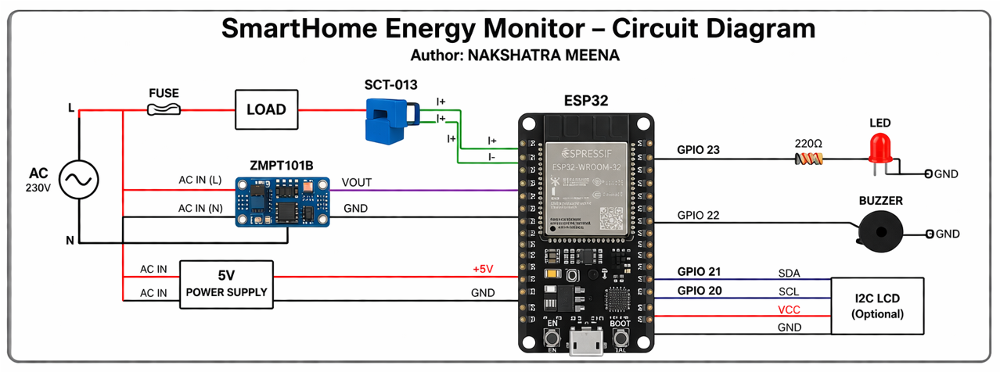
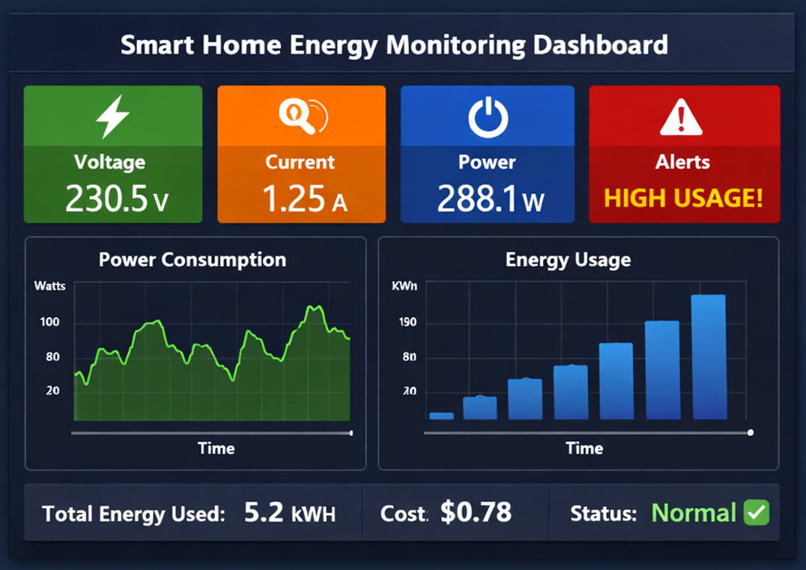
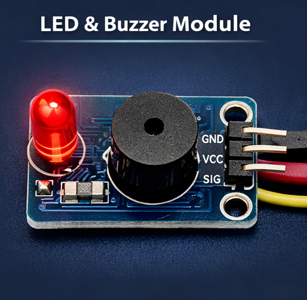

# Smart Home Energy Monitoring & Control System

**Author: NAKSHATRA MEENA**

## Project Overview
This project monitors home appliance energy consumption in real-time using an ESP32 microcontroller. It allows remote ON/OFF control of appliances and sends alerts for high power usage.

## Features
- Real-time monitoring of current and power consumption
- Remote appliance control via a ThingsBoard dashboard
- Alerts when power consumption exceeds the threshold
- Data visualization and historical tracking on the dashboard

## Components
- ESP32 Dev Module
- ACS712 Current Sensor
- Relay Module 5V
- LED/Buzzer
- Jumper wires & Breadboard
- Appliance for testing

## Software
- Arduino IDE
- PubSubClient (MQTT library)
- ThingsBoard (cloud dashboard)

## Folder Structure
SmartHomeEnergyMonitor_NakshatraMeena/
├─ Arduino_Code/SmartEnergyMonitor.ino
├─ Circuit_Diagram/Diagram.png
├─ Assets/Dashboard.png
├─ Assets/LED_Buzzer.png
└─ README.md

## Usage
1. Connect the ESP32 to sensors and the relay as shown in the circuit diagram.
2. Open Arduino IDE → Upload `SmartEnergyMonitor.ino`.
3. Connect the ESP32 to your WiFi network and ThingsBoard using your access token.
4. View real-time telemetry and appliance status on the ThingsBoard dashboard.
5. Set alerts for high power usage and control appliances remotely.

## Circuit Diagram

## Dashboard Screenshot

## Notes
- Update `ssid`, `password`, and `access_token` in `SmartEnergyMonitor.ino` before uploading.
- Adjust `powerThreshold` in the code according to your appliance’s rating.